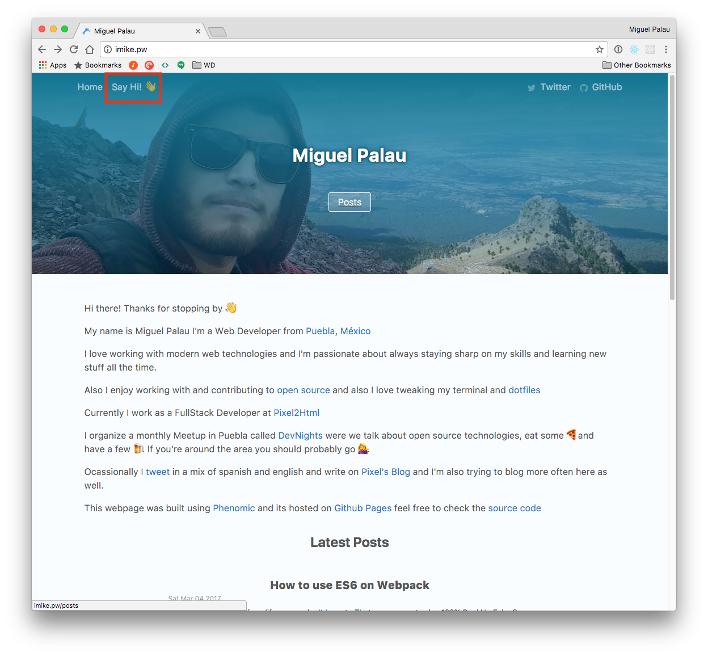

# [Phenomic](https://github.com/MoOx/phenomic) phenomic-theme-base


## Install dependencies

```sh
npm install
```

## Run development server

```sh
npm start
```

## Build for production

```sh
npm run build
```
